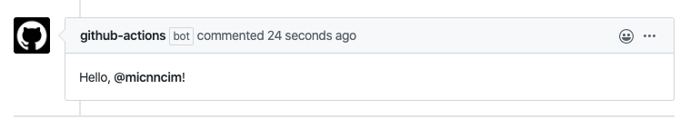

# Action Create Comment

[![actions-workflow-test][actions-workflow-test-badge]][actions-workflow-test]
[![release][release-badge]][release]



This is a GitHub Action to create a comment to an issue or a pull request.

This action extract the number from an issue or a pull request which has triggered this by default.
It means you don't need to care about something annoying like whether you should use `${{ github.event.issue.number }}` or `${{ github.event.pull_request.number }}`.

It would be more useful to use this with other GitHub Actions' outputs.

## Inputs

|      NAME      |                          DESCRIPTION                          |   TYPE   | REQUIRED |                                     DEFAULT                                     |
| -------------- | ------------------------------------------------------------- | -------- | -------- | ------------------------------------------------------------------------------- |
| `github_token` | A GitHub token.                                               | `string` | `true`   | `N/A`                                                                           |
| `body`         | The comment body.                                             | `string` | `true`   | `N/A`                                                                           |
| `repo`         | The owner and repository name. e.g.) `Codertocat/Hello-World` | `string` | `false`  | `${{ github.repository }}`                                                      |
| `number`       | The number of the issue or pull request.                      | `number` | `false`  | `${{ github.event.issue.number }}` or `${{ github.event.pull_request.number }}` |

## Example

```yaml
name: Create Comment

on: [issue_comment]

jobs:
  create_comment:
    runs-on: ubuntu-latest
    steps:
      - uses: actions/checkout@v2
      - uses: actions-ecosystem/action-create-comment@v1
        if: ${{ startsWith(github.event.comment.body, '/hello') }}
        with:
          github_token: ${{ secrets.github_token }}
          body: |
            Hello, @${{ github.actor }}!
```

## License

Copyright 2020 The Actions Ecosystem Authors.

Action Create Comment is released under the [Apache License 2.0](./LICENSE).

<!-- badge links -->

[actions-workflow-test]: https://github.com/actions-ecosystem/action-create-comment/actions?query=workflow%3ATest
[actions-workflow-test-badge]: https://img.shields.io/github/workflow/status/actions-ecosystem/action-create-comment/Test?label=Test&style=for-the-badge&logo=github

[release]: https://github.com/actions-ecosystem/action-create-comment/releases
[release-badge]: https://img.shields.io/github/v/release/actions-ecosystem/action-create-comment?style=for-the-badge&logo=github
